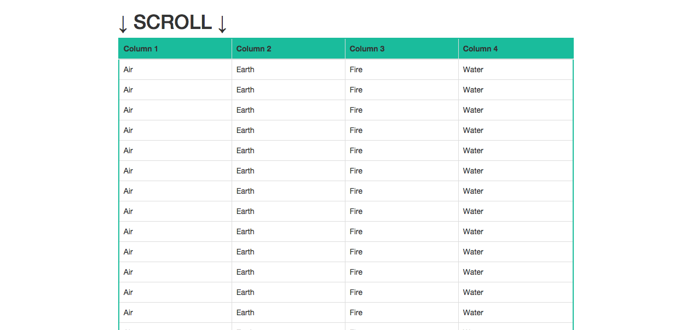

# jquery.fixedTableHeader v0.01

Enable fixed header for table without any extra css. This plugin also support for boostrap table.

# Sample usage

```html
 <script type="text/javascript">
    $(document).ready(function () {
        $('table').fixedTableHeader();
    });
</script>
```

# Demo

